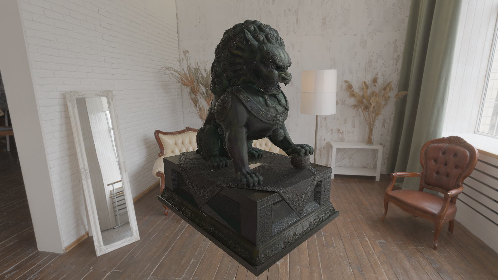

# Graphite
This is a CUDA-based path tracer developed from scratch for rendering glTF 2.0 models. Designed for research purposes, it utilizes advanced path tracing techniques to simulate realistic lighting and material interactions. The project offers a flexible framework for experimenting with rendering algorithms and exploring state-of-the-art graphics rendering methods.

> [!IMPORTANT] 
This project is still under development

## Rendering Equation
The rendering equation models the transport of light in a scene, describing how light is reflected from surfaces to the camera. It accounts for both direct and indirect lighting, incorporating material properties and the geometry of the scene. Solving this equation enables realistic image synthesis in path tracing algorithms.

$$L_{o} \left (  p, w_{o} \right ) = L_{e} \left (  p, w_{o} \right ) + \int_{\Omega} f_{r}\left (  p, w_{i}, w_{o} \right ) L_{i} \left (  p, w_{i} \right ) \cos{\theta} dw_{i}$$

### Monte Carlo estimator for GGX Microfacet BRDF
This Monte Carlo estimator samples reflection directions according to the GGX distribution, ensuring physically accurate microfacet-based shading. It accounts for the distribution of normals and the Fresnel-Schlick approximation, improving realism in path-traced renders.

[Sampling the GGX Distribution of Visible Normals](https://jcgt.org/published/0007/04/01/paper.pdf)

$$\int_{\Omega} f_{r}\left (  p, w_{i}, w_{o} \right ) L_{i} \left (  p, w_{i} \right ) \cos{\theta} dw_{i} \approx \frac{1}{n}\sum_{i=1}^n  L_{i} \left (  p, w_{i} \right ) \frac{F(w_o \angle w_i)G_2(w_o, w_i)}{G_1(w_o)}$$

# Dependencies
* [stb_image](https://github.com/nothings/stb) for reading and writing images.
* [tinygltf](https://github.com/syoyo/tinygltf) for reading glTF 2.0 models.
* [CUDA Toolkit](https://developer.nvidia.com/cuda-toolkit) nvcc for compiling CUDA code.

# Output

